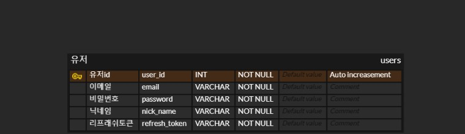
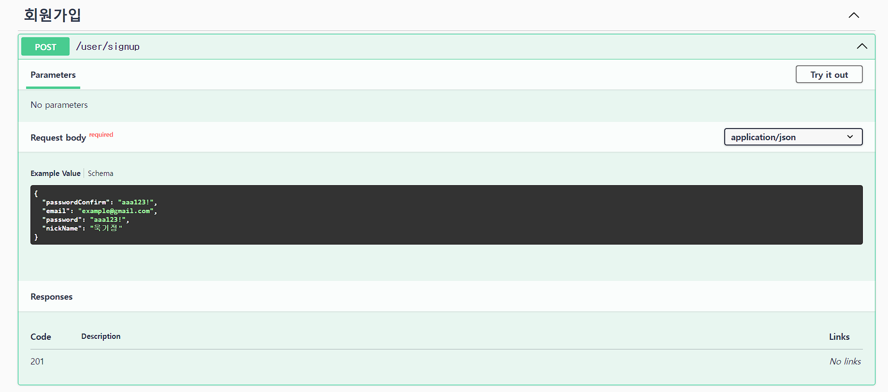
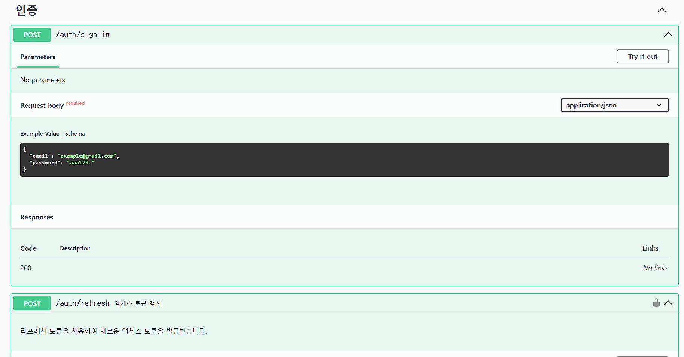

## ERD

## API 명세서

## 프로젝트 개요

E-Commerce 형태를 띠는 거의 모든 서비스의 기본적인 기능으로, 개발자로서 가장 필요한 기초적인 역량이기 때문에 로그인 / 회원가입에 얕은 수준의 프로젝트가 아니라 Nest.js를 사용하여 RESTful API에 맞게 기능을 구현하고, Nest.js 와 TypeORM을 이용하여 Node에서 강력한 프레임워크를 사용해서 현직에서 활용하는 도구를 사용하기 위해서 프로젝트를 진행했다.

먼저 Nest.js와 TypeORM을 이용하여 서버를 구동하기 위한 기본적인 세팅과 데이터베이스를 연결하여 작업 환경을 만들어 주었다.

회원가입 API를 구현하기 위해서 이메일, 비밀번호, 닉네임을 유효성 검증과 db에 저장할 때 비밀번호를 hash화 시켜서 저장하였다. 또한 비밀번호 확인을 추가하여 클라이언트가 비밀번호를 오타로 인해 회원가입 하였지만 로그인 못하는 상황을 방지하기 위해서 비밀번호와 비밀번호 확인을 통해서 2중으로 비밀번호의 확실성을 보장해주었다.

로그인 API를 구현하면서 이메일 유효성 검사와 이메일이 db에 존재하지 않을 때 에러 처리, 이메일과 비밀번호의 불일치 처리로 로그인 로직에 대한 구현을 진행하였고, 로그인 성공 시 jwt 토큰인 AccessToken을 발급하여 return 하는 동시에 RefreshToken 또한 발급하여 db의 각 유저의 컬럼에 저장 시켜 주었다.

passport를 통하여 jwt와 local 로그인, 인증 관리를 만들어 주었다.

AccessToken과 RefreshToken 으로 인증 할 수 있는 가드를 만들어 각 토큰의 사용 목적에 따라 검증하는 로직을 구현했다.

각 로직에 필요한 에러 처리를 위한 에러핸들링 미들웨어를 구현하고자 했다.

보안 측면에서 로그인, 회원가입 등 클라이언트와 서버 양쪽 다 안전한 고려 사항을 추가하려고 했다.

## 구현하면서 중요하게 생각했던 점

"프로젝트를 진행하며 가장 중요하게 생각했던 두 가지 핵심 원칙은 '보안'과 '사용자 편의성'이었습니다.

먼저, 보안 측면에서는 회원 가입과 로그인 과정에서의 정보 보호를 위해 별도의 유효성 검증과 함께, 비밀번호를 해시화하여 데이터베이스에 저장하는 등의 방식을 도입했습니다. 또한, 입력한 비밀번호의 정확성을 보장하기 위해 비밀번호 확인 과정을 추가하여 오타 등으로 인한 로그인 실패를 예방했습니다. 이외에도, 로그인 성공 시에는 AccessToken과 RefreshToken을 발급하여 사용자 인증 관리를 효과적으로 할 수 있도록 했습니다. 이처럼 여러 보안 기술을 도입함으로써 사용자의 정보를 안정적으로 보호하면서, 서비스의 신뢰성을 높이는 데 주력하였습니다.

다음으로, 사용자 편의성을 고려한 점은 매번 로그인하는 것이 번거롭다는 사용자의 불편함을 해소하기 위한 것이었습니다. 이를 위해, 자동 로그인 기능을 구현하여 사용자가 매번 로그인하지 않아도 되도록 했습니다. 이 기능은 사용자가 서비스를 이용하는 데 있어서 편리함을 제공하며, 서비스에 대한 만족도를 높이는 데 기여하였습니다.

결과적으로, 이 프로젝트를 통해 사용자의 정보 보호와 동시에 사용자 경험을 향상시키는 방안을 구현하는 데 성공하였다고 생각합니다. 이를 위해 Nest.js와 TypeORM 같은 강력한 프레임워크를 활용하여 RESTful API를 구현하였고, 이를 통해 현직에서 활용하고 있는 도구를 실질적으로 사용해볼 수 있었습니다. 이 경험은 제가 개발자로서 보안과 사용자 편의성이라는 두 가지 핵심 원칙을 지키며 서비스를 개발하는 데 큰 도움이 되었습니다."
